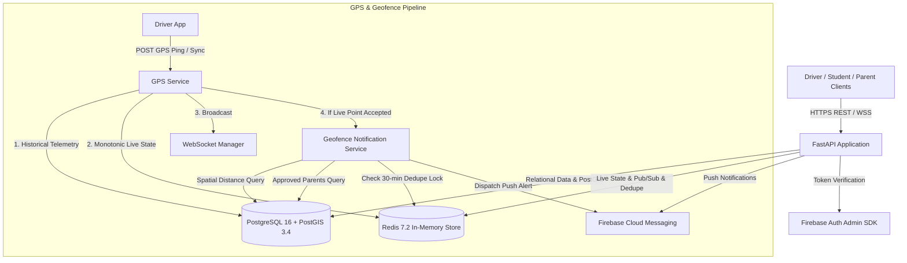

# SMARTBUS Backend — Campus Transit, Tracking & Safety API

> **Status:** Phase 16 Complete — Geofence-Based Bus Nearby & Bus Arrived Notifications + Evaluation Baseline.  
> **Evaluation Target:** ~75% Backend Completion (Foundations, Transit Operations, Spatial Tracking, Parent Portal & Realtime Push Notifications).

---

## Table of Contents

| # | Section |
|---|---------|
| 1 | [Project Overview](#1-project-overview) |
| 2 | [Current Implementation Status](#2-current-implementation-status) |
| 3 | [Architecture & Data Flow](#3-architecture--data-flow) |
| 4 | [Repository & Project Structure](#4-repository--project-structure) |
| 5 | [Technology Stack & Versions](#5-technology-stack--versions) |
| 6 | [Database Models & Schema Design](#6-database-models--schema-design) |
| 7 | [Authentication & RBAC](#7-authentication--role-based-access-control-rbac) |
| 8 | [Role Capability Matrix](#8-role-capability-matrix) |
| 9 | [Comprehensive API Documentation](#9-comprehensive-api-documentation) |
| 10 | [GPS Telemetry & Real-Time Pipeline](#10-gps-telemetry--real-time-pipeline) |
| 11 | [Offline GPS Batch Synchronization](#11-offline-gps-batch-synchronization) |
| 12 | [PostGIS Spatial Engine & Geofencing](#12-postgis-spatial-engine--geofencing) |
| 13 | [Push Notification & Deduplication System](#13-push-notification--deduplication-system) |
| 14 | [Parent-Child Linking & Approval Workflow](#14-parent-child-linking--approval-workflow) |
| 15 | [Deterministic Baseline ETA Engine](#15-deterministic-baseline-eta-engine) |
| 16 | [WebSocket Real-Time Location Streaming](#16-websocket-real-time-location-streaming) |
| 17 | [Environment Variables Reference](#17-environment-variables-reference) |
| 18 | [Local Development Setup](#18-local-development-setup) |
| 19 | [Docker Compose Infrastructure](#19-docker-compose-infrastructure) |
| 20 | [Practical API Workflow Examples](#20-practical-api-workflow-examples) |
| 21 | [Error Handling & HTTP Status Codes](#21-error-handling--http-status-codes) |
| 22 | [Automated Testing Suite](#22-automated-testing-suite) |
| 23 | [Security & Privacy Controls](#23-security--privacy-controls) |
| 24 | [Future Work](#24-future-work-evaluation-2--post-evaluation) |
| 25 | [Recommended Evaluation Demo Flow](#25-recommended-evaluation-demo-flow) |

---

## 1. Project Overview

**SMARTBUS** is a specialized, production-ready campus transit, safety, and tracking backend designed for collegiate shuttle systems. Operating a university transit network involves critical challenges: students stranded at stops, parents anxious about delays, drivers navigating irregular connectivity, and administrative overhead managing fleet assignments.

SMARTBUS solves these challenges by providing:
1. **Real-Time GPS Tracking & Monotonic State:** Sub-second live bus tracking backed by Redis and real-time WebSocket streaming with strict timestamp monotonicity.
2. **Offline-Resilient Telemetry:** Mobile GPS batch queuing and synchronization with UUID-based deduplication for intermittent connectivity campus environments.
3. **PostGIS Spatial Geofencing:** Geodesic proximity detection calculating real-time distances to route stops on Earth ellipsoids (`SRID 4326`).
4. **Automated FCM Push Notifications:** Event-driven proximity alerts (`BUS_NEARBY` and `BUS_ARRIVED`) dispatched to authorized parents with 30-minute Redis deduplication locks.
5. **Privacy-Preserving Parent Portal:** Strict parent-child linking requiring two-way student verification before location access is granted.
6. **Deterministic Baseline ETA Engine:** Real-time distance and estimated arrival calculations for ordered route stops based on dynamic live telemetry.

---

## 2. Current Implementation Status

The SMARTBUS backend has reached approximately **75% completion** (representing full delivery of Round 1 / Evaluation 1 milestones):

| Capability / Module | Status | Description |
| :--- | :---: | :--- |
| **Firebase JWT Authentication** | ✅ Implemented | Token verification, claims decoding, user identity mapping. |
| **Four-Tier RBAC** | ✅ Implemented | Strict role enforcement (`ADMIN`, `DRIVER`, `STUDENT`, `PARENT`). |
| **Student Domain Restriction** | ✅ Implemented | Enforces `@sode-edu.in` domain on student email addresses. |
| **Bus Fleet Management** | ✅ Implemented | Full CRUD, registration checks, unique bus numbers, capacity. |
| **Routes & Boarding Points** | ✅ Implemented | Ordered route stops, coordinate validation, sequence management. |
| **Driver Assignment & Trips** | ✅ Implemented | Driver-bus association, lifecycle state machine (`SCHEDULED` $\rightarrow$ `IN_PROGRESS` $\rightarrow$ `COMPLETED` / `CANCELLED`). |
| **GPS Telemetry Ingestion** | ✅ Implemented | Driver ownership verification, telemetry coordinate bounds, persistence. |
| **Offline GPS Batch Sync** | ✅ Implemented | Batch upload (1–500 points), `client_id` deduplication, retry idempotency. |
| **Redis Live Location Tracking** | ✅ Implemented | In-memory latest state with atomic Lua monotonic epoch protection. |
| **Realtime WebSockets** | ✅ Implemented | Streaming telemetry per trip, Redis Pub/Sub, authenticated access. |
| **Parent-Child Link Approval** | ✅ Implemented | Student approval workflow, child privacy boundary, live tracking. |
| **PostGIS Spatial Engine** | ✅ Implemented | Spatial `geography(Point, 4326)` columns, GiST indexes, `ST_Distance`, `ST_DWithin`. |
| **Deterministic ETA Engine** | ✅ Implemented | Real-time distance and arrival time estimation across ordered stops. |
| **FCM Push Notification Base** | ✅ Implemented | Device token registry, privacy redaction, Firebase Admin SDK integration. |
| **Geofence Proximity Alerts** | ✅ Implemented | Automatic `BUS_NEARBY` (500m) and `BUS_ARRIVED` (100m) notification triggers. |
| **Redis 30-min Deduplication** | ✅ Implemented | Per-recipient, per-stop, per-event lock preventing notification spam. |
| **Email Notification Channel** | ⏳ Future Work | Planned background email dispatch for urgent circulars. |
| **Notification Background Workers** | ⏳ Future Work | Dedicated ARQ / Celery worker queue for massive notification scale. |
| **AI / Machine Learning ETA** | ⏳ Future Work | Dynamic speed prediction based on historical traffic patterns. |
| **Advanced Accident / SOS Engine**| ⏳ Future Work | Accelerometer crash telemetry and multi-channel emergency escalation. |

---

## 3. Architecture & Data Flow



### Component Responsibilities:
- **FastAPI Layer:** Asynchronous request routing, Pydantic schema validation, role-based dependency injection, and error formatting.
- **PostgreSQL 16 + PostGIS 3.4:** Source of truth for users, fleet, routes, stops, trips, audit history, spatial coordinates, and persistent notification logs.
- **Redis 7.2:** Ultra-low latency cache for latest trip location, Lua atomic scripts preventing stale GPS updates, Pub/Sub message broker for WebSockets, and 30-minute deduplication locks.
- **Firebase Admin SDK:** Verifies cryptographic client identity tokens and delivers FCM push notifications to Android, iOS, and Web devices.

---

## 4. Repository & Project Structure

```text
YatraSetu/
├── backend/                      # All backend source code & infrastructure
│   ├── alembic/                  # Alembic database migration environment
│   │   └── versions/             # Versioned migration revision scripts
│   ├── app/
│   │   ├── api/                  # REST & WebSocket API endpoints
│   │   │   └── v1/
│   │   │       ├── auth.py           # User registration & parent signup
│   │   │       ├── boarding_points.py# Campus bus boarding points
│   │   │       ├── buses.py          # Fleet management
│   │   │       ├── drivers.py        # Driver-bus assignments
│   │   │       ├── gps.py            # GPS ingestion & batch sync
│   │   │       ├── health.py         # Service health & readiness probes
│   │   │       ├── notifications.py  # FCM device token management
│   │   │       ├── parent_links.py   # Student approval / rejection of link requests
│   │   │       ├── parents.py        # Parent portal & approved child tracking
│   │   │       ├── rbac.py           # Role validation test endpoints
│   │   │       ├── routes.py         # Bus routes & route stops
│   │   │       ├── trips.py          # Trip lifecycle management & ETA
│   │   │       └── ws.py             # WebSocket streaming endpoint
│   │   │
│   │   ├── core/
│   │   │   ├── config.py             # Pydantic Settings & environment validation
│   │   │   ├── firebase.py           # Firebase Admin SDK initialization & token auth
│   │   │   ├── redis.py              # Redis async client & connection pooling
│   │   │   └── security.py           # RBAC dependency guards (require_role, etc.)
│   │   │
│   │   ├── db/
│   │   │   ├── base.py               # SQLAlchemy 2.0 DeclarativeBase
│   │   │   └── database.py           # AsyncEngine & async session factory
│   │   │
│   │   ├── models/                   # SQLAlchemy ORM database models
│   │   │   ├── boarding_point.py     # BoardingPoint entity with geography coords
│   │   │   ├── bus.py                # Bus entity
│   │   │   ├── device_token.py       # UserDeviceToken entity
│   │   │   ├── enums.py              # UserRole, TripStatus, NotificationType, etc.
│   │   │   ├── location.py           # LocationPing historical GPS telemetry
│   │   │   ├── notification.py       # Persistent Notification audit entity
│   │   │   ├── parent_child.py       # ParentLinkRequest & ParentChildren models
│   │   │   ├── route.py              # Route entity
│   │   │   ├── route_stop.py         # RouteStop association model
│   │   │   ├── trip.py               # Trip lifecycle entity
│   │   │   └── user.py               # User entity with role & assigned_bus
│   │   │
│   │   ├── schemas/                  # Pydantic serialization & validation schemas
│   │   └── services/                 # Business logic service abstractions
│   │       ├── boarding_point_service.py
│   │       ├── bus_service.py
│   │       ├── driver_service.py
│   │       ├── eta_service.py
│   │       ├── geofence_notification_service.py # Phase 16: Geofence notifications
│   │       ├── geofence_service.py   # PostGIS spatial calculations & Haversine fallback
│   │       ├── gps_service.py        # GPS ingestion, batch sync, & Redis update
│   │       ├── notification_service.py # Phase 15: FCM dispatch & Redis dedupe
│   │       ├── parent_child_service.py
│   │       ├── route_service.py
│   │       ├── route_stop_service.py
│   │       ├── trip_service.py
│   │       └── websocket_manager.py  # WebSocket connection manager & broadcast
│   │
│   ├── tests/                        # Pytest automated test suite (189 tests)
│   │   ├── conftest.py               # In-memory Redis & test client fixtures
│   │   ├── test_auth.py
│   │   ├── test_buses.py
│   │   ├── test_eta.py
│   │   ├── test_geofence.py
│   │   ├── test_geofence_notifications.py # Phase 16 tests (35 test cases)
│   │   ├── test_gps.py
│   │   ├── test_gps_sync.py
│   │   ├── test_notifications.py     # Phase 15 tests (12 test cases)
│   │   ├── test_parent_child.py
│   │   ├── test_routes.py
│   │   ├── test_trips.py
│   │   ├── test_websocket.py
│   │   └── ...
│   │
│   ├── alembic.ini                   # Alembic configuration
│   ├── pytest.ini                    # Pytest configuration (pythonpath = .)
│   ├── requirements.txt              # Production & test dependencies
│   ├── docker-compose.yml            # Local PostgreSQL/PostGIS + Redis (name: yatrasetu)
│   └── .env.example                  # Environment configuration template
│
├── README.md                         # Project documentation (this file)
└── .gitignore
```

---

## 5. Technology Stack & Versions

- **Runtime & Language:** Python `3.11.5`
- **Web Framework:** FastAPI `0.115.0+`
- **ASGI Server:** Uvicorn `0.30.0+`
- **Database Engine:** PostgreSQL `16.3` with PostGIS `3.4` (Alpine)
- **Database Driver:** `asyncpg 0.29.0+` (async asyncio-native PostgreSQL driver)
- **ORM & Migrations:** SQLAlchemy `2.0.35+`, Alembic `1.13.2+`, GeoAlchemy2 `0.15.2`
- **In-Memory Cache & Pub/Sub:** Redis `7.2` (via `redis.asyncio` with connection pool)
- **Identity & Push:** Firebase Admin SDK `6.5.0+` (`firebase-admin.auth`, `firebase-admin.messaging`)
- **Settings & Validation:** Pydantic `2.9.0+`, Pydantic Settings `2.5.0+`, Email Validator
- **Testing:** Pytest `8.4.2`, pytest-asyncio `0.26.0`, HTTPX `0.27.2`

---

## 6. Database Models & Schema Design

All tables utilize UUID primary keys generated server-side. Spatial attributes leverage the OpenGIS `geography(Point, 4326)` standard:

```
                  ┌──────────────┐
                  │    users     │
                  └──────┬───────┘
                         │ 1:N
        ┌────────────────┼────────────────┬────────────────┐
        ▼                ▼                ▼                ▼
┌──────────────┐ ┌──────────────┐ ┌──────────────┐ ┌──────────────┐
│ user_device  │ │ parent_link  │ │parent_children│ │  trips (drvr)│
│   _tokens    │ │   _requests  │ │ (approved)   │ │              │
└──────────────┘ └──────────────┘ └──────────────┘ └──────┬───────┘
                                                          │ 1:N
┌──────────────┐ ┌──────────────┐ ┌──────────────┐        ▼
│    routes    │─│ route_stops  │─│boarding_point│ ┌──────────────┐
└──────────────┘ └──────────────┘ └──────────────┘ │location_pings│
                                                   └──────────────┘
```

### Core Entities:
1. **`users`**: Central identity entity mapping `firebase_uid`, `email`, `full_name`, `role` (`ADMIN`, `DRIVER`, `STUDENT`, `PARENT`), and `assigned_bus_id`.
2. **`buses`**: Fleet records with unique `bus_number`, `registration_number`, `capacity`, and active status.
3. **`routes`**: Travel paths with unique route `code` and descriptive names.
4. **`boarding_points`**: Designated stops with latitude/longitude coordinates and spatial PostGIS points.
5. **`route_stops`**: Ordered association linking routes to boarding points with unique `(route_id, stop_order)` constraints.
6. **`trips`**: Operational route runs linking a route, a bus, and an assigned driver with strict status lifecycle: `SCHEDULED` $\rightarrow$ `IN_PROGRESS` $\rightarrow$ `COMPLETED` / `CANCELLED`.
7. **`location_pings`**: Comprehensive historical GPS audit trail with client UUID, coordinates, timestamp, speed, heading, and accuracy.
8. **`parent_link_requests`**: Pending or rejected linking requests initiated by parents referencing a student's institutional email.
9. **`parent_children`**: Verified parent-student relationships created solely when a student approves a request.
10. **`user_device_tokens`**: Registered client FCM push notification tokens per user, platform (`ANDROID`, `IOS`, `WEB`), and active status.
11. **`notifications`**: Persistent audit record of every generated notification, tracking `recipient_id`, `notification_type`, `channel`, `status` (`PENDING`, `SENT`, `FAILED`), and event metadata.

---

## 7. Authentication & Role-Based Access Control (RBAC)

Authentication is handled securely via **Firebase Authentication**:
1. Clients exchange credentials with Firebase on mobile/web to receive a cryptographically signed Firebase ID Token (JWT).
2. Every request passes the token in the `Authorization: Bearer <token>` header (or WebSocket `token` query param).
3. The backend decodes and verifies the token against Google's public keys (`app/core/firebase.py`).
4. The verified Firebase UID is mapped to the internal PostgreSQL `User` record to enforce application-level roles.
5. **Strict Student Domain Enforcement:** During student registration, the email must end strictly in `@sode-edu.in`. Spoofed, arbitrary, or subdomain addresses are rejected with `422 Unprocessable Entity`.
6. **Error Responses:**
   - `401 Unauthorized`: Token missing, expired, revoked, or malformed.
   - `403 Forbidden`: Authenticated user lacks the requisite role or resource ownership.

---

## 8. Role Capability Matrix

| Feature / Action | ADMIN | DRIVER | STUDENT | PARENT |
| :--- | :---: | :---: | :---: | :---: |
| Register User Account | ✅ | ✅ | ✅ (`@sode-edu.in`) | ✅ (via child link) |
| Manage Buses (Create/Edit/Deactivate) | ✅ | ❌ | ❌ | ❌ |
| Manage Routes & Boarding Points | ✅ | ❌ | ❌ | ❌ |
| Assign Driver to Bus | ✅ | ❌ | ❌ | ❌ |
| Create / Schedule Trips | ✅ | ❌ | ❌ | ❌ |
| Start / Complete Assigned Trips | ❌ | ✅ (Own trip only) | ❌ | ❌ |
| Submit Live GPS Telemetry | ❌ | ✅ (Assigned bus only) | ❌ | ❌ |
| Sync Offline GPS Batches | ❌ | ✅ (Assigned bus only) | ❌ | ❌ |
| Access WebSocket Realtime Stream | ✅ | ✅ (Own trip) | ✅ (Assigned bus) | ✅ (Approved child) |
| Access Trip Live Location | ✅ | ✅ (Own trip) | ✅ (Assigned bus) | ✅ (Approved child) |
| Query Deterministic Trip ETA | ✅ | ✅ (Own trip) | ✅ (Assigned bus) | ✅ (Approved child) |
| Approve / Reject Parent Links | ❌ | ❌ | ✅ (Own requests) | ❌ |
| Register Device FCM Tokens | ✅ | ✅ | ✅ | ✅ |
| Receive Geofence Push Notifications | ❌ | ❌ | ❌ | ✅ (Approved child) |

---

## 9. Comprehensive API Documentation

All versioned endpoints are mounted under `/api/v1`.

### Health & Diagnostic Endpoints
- `GET /` — Welcome and service verification probe.
- `GET /api/v1/health` — Comprehensive readiness probe checking PostgreSQL and Redis connection pools.

### Authentication & Users
- `POST /api/v1/auth/register` — Register new user (`ADMIN`, `DRIVER`, `STUDENT`). Requires valid Firebase token.
- `POST /api/v1/auth/register-parent` — Register parent account with student child email link. Creates `PENDING` link request.
- `GET /api/v1/auth/me` — Retrieve authenticated user profile and assigned bus details.

### Bus Management
- `POST /api/v1/buses` — Create new bus (ADMIN only).
- `GET /api/v1/buses` — List active buses.
- `GET /api/v1/buses/{id}` — Retrieve bus details by ID.
- `PUT /api/v1/buses/{id}` — Update bus metadata (ADMIN only).
- `DELETE /api/v1/buses/{id}` — Soft-delete / deactivate bus (ADMIN only).

### Routes & Stops
- `POST /api/v1/routes` — Create transit route (ADMIN only).
- `GET /api/v1/routes` — List routes.
- `GET /api/v1/routes/{id}` — Get route details with ordered stops.
- `POST /api/v1/boarding-points` — Create new boarding point with lat/lng coordinates (ADMIN only).
- `GET /api/v1/boarding-points` — List boarding points.
- `POST /api/v1/routes/{id}/stops` — Append boarding point to route with sequence order (ADMIN only).
- `PUT /api/v1/routes/{id}/stops/reorder` — Reorder stops sequence on a route (ADMIN only).

### Driver Assignments & Trips
- `POST /api/v1/drivers/{driver_id}/assign-bus` — Assign driver to bus (ADMIN only).
- `POST /api/v1/trips` — Schedule new trip (ADMIN only).
- `GET /api/v1/trips` — List trips filtered by status or date.
- `POST /api/v1/trips/{id}/start` — Driver transitions trip to `IN_PROGRESS`.
- `POST /api/v1/trips/{id}/complete` — Driver completes trip; cleans up live Redis state.
- `POST /api/v1/trips/{id}/cancel` — Admin or driver cancels trip.
- `GET /api/v1/trips/{id}/eta` — Retrieve deterministic ETA for all ordered route stops.

### GPS Telemetry & Tracking
- `POST /api/v1/trips/{id}/gps` — Driver posts live GPS telemetry ping. Evaluates geofences if accepted.
- `POST /api/v1/trips/{id}/gps/sync` — Driver uploads batch of offline-queued GPS points (1–500 points).
- `GET /api/v1/trips/{id}/gps/live` — Fetch latest live telemetry from Redis.
- `GET /api/v1/trips/{id}/gps/history` — Fetch historical GPS pings from PostgreSQL.
- `WSS /api/v1/ws/trips/{id}` — Authenticated WebSocket for real-time telemetry streaming.

### Parent Portal & Child Linking
- `GET /api/v1/parent-links` — Student lists pending link requests.
- `POST /api/v1/parent-links/{id}/approve` — Student approves link request; creates `ParentChildren`.
- `POST /api/v1/parent-links/{id}/reject` — Student rejects link request.
- `GET /api/v1/parent/children` — Parent lists approved linked children.
- `GET /api/v1/parent/children/{student_id}/live` — Parent fetches approved child's live bus telemetry.

### Push Notifications & Device Tokens
- `POST /api/v1/notifications/devices` — Register or reactivate device FCM push token.
- `DELETE /api/v1/notifications/devices/{id}` — Deactivate device token (`is_active = False`).

---

## 10. GPS Telemetry & Real-Time Pipeline

The SMARTBUS GPS ingestion pipeline guarantees strict consistency, history preservation, and non-blocking real-time broadcasts:

```text
Driver Device (Mobile App)
       │
       ▼ POST /api/v1/trips/{trip_id}/gps (HTTP Bearer Auth)
FastAPI Verification Layer
       │ 1. Validate DRIVER role & assigned bus match
       │ 2. Validate Trip is IN_PROGRESS
       │ 3. Validate coordinate bounds (-90<=lat<=90, -180<=lon<=180)
       ▼
PostgreSQL Ingestion
       │ Persist LocationPing (retains all points chronologically)
       ▼
Redis Atomic State Engine (Lua Script)
       │ Eval: compare recorded_at_epoch >= current_epoch
       ├───► If newer or equal:
       │        - Update Redis key `smartbus:trip:{id}:live`
       │        - Publish to Redis channel `smartbus:trip:{id}:location`
       │        - Broadcast to in-process WebSockets
       │        - TRIGGER GEOFENCE NOTIFICATION PIPELINE
       │
       └───► If older (stale):
                - Live state remains untouched (monotonic protection)
                - Suppress geofence notifications
```

---

## 11. Offline GPS Batch Synchronization

To support buses passing through campus dead zones without data coverage:
- **Mobile SQLite Queue:** The mobile app stores GPS points locally in SQLite/Drift when offline.
- **Batch Upload:** When network returns, the driver app uploads up to 500 points in a single POST request to `/api/v1/trips/{trip_id}/gps/sync`.
- **Client UUID Deduplication:** Every point carries a client-generated UUID `client_id`. Points previously inserted in PostgreSQL are filtered out without failing the batch.
- **Intra-Batch Deduplication:** Redundant points within the same batch payload are resolved.
- **Monotonic Advancement:** Accepted points are sorted chronologically by `recorded_at` before updating Redis live state, guaranteeing the live pointer advances monotonically forward.
- **Fault-Tolerant Retry:** Re-submitting an entire batch returns `accepted: 0, duplicates: N` with `200 OK` and generates zero duplicate notifications.

---

## 12. PostGIS Spatial Engine & Geofencing

Spatial operations are executed directly inside PostgreSQL using the PostGIS spatial engine:
- **Ellipsoidal Distance (`ST_Distance`):** Computes exact geodesic distance in meters over the WGS-84 ellipsoid:
  $$\text{ST\_Distance}(\text{geog1}, \text{geog2})$$
- **Spatial Bounding (`ST_DWithin`):** Rapid indexed proximity filtering utilizing PostgreSQL GiST R-Tree indexes.
- **Haversine Fallback:** A pure Python spherical geodesic fallback is provided for non-PostGIS development testing environments.

### Geofence Radii Semantics:
- **`BUS_ARRIVAL_RADIUS_METERS = 100.0`**:
  - Condition: $\text{distance} \le 100\text{m}$.
  - Event: `BUS_ARRIVED`.
- **`BUS_NEARBY_RADIUS_METERS = 500.0`**:
  - Condition: $100\text{m} < \text{distance} \le 500\text{m}$.
  - Event: `BUS_NEARBY`.
- **Strict Route Isolation:** Spatial proximity is evaluated **only** against stops belonging strictly to the current trip's route (`RouteStop.route_id == trip.route_id`). Stops from other campus routes are never checked.

---

## 13. Push Notification & Deduplication System

SMARTBUS features an event-driven push notification pipeline:

```text
Geofence Proximity Detected (BUS_NEARBY / BUS_ARRIVED)
       │
       ▼
Query Approved Parent Recipients
       │ SELECT parent_id FROM parent_children WHERE student.assigned_bus_id = trip.bus_id
       ▼
Redis 30-Minute Deduplication Check (Per Recipient)
       │ Key: `smartbus:notification:dedupe:{recipient_id}:{type}:{event_key}`
       │ Command: SET ... EX 1800 NX
       ├───► If Key Exists: Suppress duplicate notification
       │
       └───► If Key Acquired:
                1. Insert `Notification` in PostgreSQL with status PENDING
                2. Non-blocking dispatch via Firebase Admin SDK (`asyncio.to_thread`)
                3. Update `Notification.status` to `SENT` and record `sent_at`
                4. On `UnregisteredError`: Automatically deactivate invalid device token
```

### Notification Structured Payload (`Notification.data_payload`):
```json
{
  "trip_id": "8f3b1234-5678-4321-abcd-ef0123456789",
  "route_stop_id": "c1a2b3c4-d5e6-7f8a-9b0c-1d2e3f4a5b6c",
  "boarding_point_id": "7a8b9c0d-1e2f-3a4b-5c6d-7e8f9a0b1c2d",
  "boarding_point_name": "Campus Main Gate",
  "bus_id": "3b2a1c0d-4e5f-6a7b-8c9d-0e1f2a3b4c5d",
  "event_type": "BUS_NEARBY",
  "distance_meters": 342.5
}
```

---

## 14. Parent-Child Linking & Approval Workflow

Student safety and privacy are paramount. Parents are strictly prevented from viewing student transit telemetry without explicit consent:

1. **Parent Registration (`POST /api/v1/auth/register-parent`):**
   - Parent provides their credentials and their child's institutional email (`student@sode-edu.in`).
   - Backend validates the student exists and holds the `STUDENT` role.
   - Creates a `ParentLinkRequest` in `PENDING` status.
2. **Student Review (`GET /api/v1/parent-links`):**
   - The student logs in and views their own pending requests.
3. **Student Approval (`POST /api/v1/parent-links/{id}/approve`):**
   - Student approves the request.
   - Creates an immutable `ParentChildren` row and marks request `APPROVED`.
4. **Access Unlocked:**
   - Only parents with verified `ParentChildren` relationships can query live location (`GET /api/v1/parent/children/{id}/live`) and receive geofence push notifications.

---

## 15. Deterministic Baseline ETA Engine

The ETA Engine provides estimated arrival times for all remaining stops along an active trip:
- **Dynamic Live Position:** Retrieves current bus latitude/longitude from Redis live state.
- **Ordered Stop Sequence:** Queries route stops sorted by `stop_order ASC`.
- **Geodesic Distance:** Computes exact PostGIS spatial distance from bus to each stop.
- **Configurable Speed (`DEFAULT_ETA_SPEED_MPS = 8.0` m/s $\approx$ 28.8 km/h):**
  $$\text{ETA (seconds)} = \frac{\text{Distance (meters)}}{\text{Average Speed (m/s)}}$$
- **Timezone-Aware Timestamps:** Returns both `distance_meters`, `eta_seconds`, and absolute UTC `estimated_arrival_at`.

---

## 16. WebSocket Real-Time Location Streaming

SMARTBUS provides bidirectional real-time telemetry over WebSockets:
- **Endpoint:** `WSS /api/v1/ws/trips/{trip_id}?token=<firebase_id_token>`
- **Authorization:** Verifies Firebase token and enforces role access rules.
- **Immediate State Handshake:** On connection, the server immediately sends the current live location state cached in Redis.
- **Redis Pub/Sub Streaming:** Subscribes to `smartbus:trip:{trip_id}:location` and broadcasts updates as GPS pings arrive.
- **Graceful Lifecycle Handling:** Notifies connected clients when a trip completes or is cancelled.

---

## 17. Environment Variables Reference

| Variable Name | Type | Default | Description |
| :--- | :---: | :---: | :--- |
| `APP_NAME` | string | `SMARTBUS Backend` | Application title reported in OpenAPI docs |
| `APP_VERSION` | string | `0.1.0` | Semantic version of backend API |
| `ENVIRONMENT` | string | `development` | Environment mode (`development`, `production`) |
| `DEBUG` | boolean | `true` | Enable debug mode and verbose tracebacks |
| `POSTGRES_USER` | string | `smartbus_user` | PostgreSQL database user |
| `POSTGRES_PASSWORD`| string | `smartbus_password` | PostgreSQL database password |
| `POSTGRES_HOST` | string | `localhost` | PostgreSQL host address |
| `POSTGRES_PORT` | integer | `5432` | PostgreSQL port (5434 for local Docker Compose) |
| `POSTGRES_DB` | string | `smartbus_db` | PostgreSQL database name |
| `DATABASE_URL` | string | *Generated* | Full asyncpg connection URI |
| `REDIS_URL` | string | `redis://localhost:6379/0` | Redis connection URL with DB index |
| `FIREBASE_PROJECT_ID` | string | `None` | Firebase Project ID |
| `FIREBASE_CREDENTIALS_PATH` | string | `None` | Filepath to Firebase service account JSON |
| `FCM_ENABLED` | boolean | `true` | Globally enable/disable FCM push dispatch |
| `NOTIFICATION_DEDUPE_TTL_SECONDS` | integer | `1800` | Notification deduplication window (30 minutes) |
| `DEFAULT_GEOFENCE_RADIUS_METERS` | float | `100.0` | Baseline default geofence radius |
| `BUS_NEARBY_RADIUS_METERS` | float | `500.0` | Outer radius for `BUS_NEARBY` notification |
| `BUS_ARRIVAL_RADIUS_METERS` | float | `100.0` | Inner radius for `BUS_ARRIVED` notification |
| `DEFAULT_ETA_SPEED_MPS` | float | `8.0` | Baseline average speed for ETA (8.0 m/s) |

---

## 18. Local Development Setup

### Prerequisites
- Python `3.11.x`
- Docker & Docker Compose
- Git

### Step-by-Step Instructions:

```bash
# 1. Clone repository
git clone https://github.com/milanraj-github/YatraSetu.git
cd YatraSetu

# 2. Create and activate Python virtual environment
python -m venv .venv
# On Windows:
.\.venv\Scripts\activate
# On Linux/macOS:
source .venv/bin/activate

# 3. Install dependencies
cd backend
pip install -r requirements.txt

# 4. Configure environment variables
cp .env.example .env
# Edit .env — set POSTGRES_PORT=5434 when using the Docker Compose stack

# 5. Start PostgreSQL/PostGIS and Redis via Docker Compose
docker compose up -d

# 6. Apply database migrations
alembic upgrade head

# 7. Start FastAPI development server
uvicorn app.main:app --reload --port 8000
```

The Swagger interactive API documentation will be available at:
`http://localhost:8000/docs`

---

## 19. Docker Compose Infrastructure

The included `docker-compose.yml` provisions the persistent spatial database and Redis cache:

```yaml
services:
  postgres:
    image: postgis/postgis:16-3.4-alpine
    container_name: smartbus_postgres
    environment:
      POSTGRES_USER: smartbus_user
      POSTGRES_PASSWORD: smartbus_password
      POSTGRES_DB: smartbus_db
    ports:
      - "5434:5432"
    volumes:
      - postgres_data:/var/lib/postgresql/data

  redis:
    image: redis:7.2-alpine
    container_name: smartbus_redis
    ports:
      - "6379:6379"
    volumes:
      - redis_data:/data
```

Start containers (run from the `backend/` directory):
```bash
cd backend
docker compose up -d
```
Check health:
```bash
docker compose ps
```

---

## 20. Practical API Workflow Examples

### 1. Ingest GPS Telemetry (Driver)
```http
POST /api/v1/trips/8f3b1234-5678-4321-abcd-ef0123456789/gps
Authorization: Bearer <driver_token>
Content-Type: application/json

{
  "latitude": 13.0027,
  "longitude": 75.0000,
  "recorded_at": "2026-09-19T10:15:30Z",
  "speed_mps": 9.5,
  "heading_degrees": 180.0
}
```
**Response (`201 Created`):**
```json
{
  "id": "a1b2c3d4-e5f6-7a8b-9c0d-1e2f3a4b5c6d",
  "trip_id": "8f3b1234-5678-4321-abcd-ef0123456789",
  "latitude": 13.0027,
  "longitude": 75.0000,
  "recorded_at": "2026-09-19T10:15:30Z",
  "received_at": "2026-09-19T10:15:30.124567Z"
}
```

### 2. Fetch Trip Real-Time ETA
```http
GET /api/v1/trips/8f3b1234-5678-4321-abcd-ef0123456789/eta
Authorization: Bearer <parent_token>
```
**Response (`200 OK`):**
```json
{
  "trip_id": "8f3b1234-5678-4321-abcd-ef0123456789",
  "generated_at": "2026-09-19T10:15:31Z",
  "current_latitude": 13.0027,
  "current_longitude": 75.0000,
  "stops": [
    {
      "stop_id": "c1a2b3c4-d5e6-7f8a-9b0c-1d2e3f4a5b6c",
      "stop_order": 1,
      "boarding_point_id": "7a8b9c0d-1e2f-3a4b-5c6d-7e8f9a0b1c2d",
      "boarding_point_name": "Campus Main Gate",
      "latitude": 13.0000,
      "longitude": 75.0000,
      "distance_meters": 300.0,
      "eta_seconds": 37.5,
      "estimated_arrival_at": "2026-09-19T10:16:08.500000Z"
    }
  ]
}
```

---

## 21. Error Handling & HTTP Status Codes

The SMARTBUS API employs standardized, predictable HTTP status codes:

- `200 OK` — Successful query, update, or sync.
- `201 Created` — Successful resource creation.
- `204 No Content` — Successful deletion / token deactivation.
- `400 Bad Request` — Malformed payload or validation failure.
- `401 Unauthorized` — Missing or invalid Firebase authentication bearer token.
- `403 Forbidden` — Access denied due to role restriction or resource ownership mismatch.
- `404 Not Found` — Entity (Bus, Trip, Stop, User) does not exist.
- `409 Conflict` — State conflict (e.g., duplicate code, operating inactive bus, submitting GPS for completed trip).
- `422 Unprocessable Entity` — Pydantic schema validation error or invalid student email domain.
- `503 Service Unavailable` — Redis connection dropout or Firebase public key unreachable.

---

## 22. Automated Testing Suite

The codebase is protected by **189 automated test cases** covering unit, integration, spatial, concurrency, and security invariants:

```bash
# Run full test suite (from the backend/ directory)
cd backend
pytest -q
```
**Test Result:** `189 passed in ~50s (100% green)`

### Test Coverage Highlights:
- **Auth & RBAC (30 tests):** Token verification, role guards, student email restriction.
- **Transit Operations (45 tests):** Buses, routes, boarding points, ordered stops, driver assignment, trip lifecycle transitions.
- **GPS & Batch Sync (35 tests):** Monotonic live updates, offline batch uploads, UUID deduplication, out-of-order sorting.
- **Spatial & ETA (25 tests):** PostGIS `ST_Distance`, `ST_DWithin`, Haversine fallback, deterministic stop ETAs.
- **Parent Portal & Privacy (20 tests):** Student approval workflow, child live location isolation.
- **Push & Geofencing (35 tests):** Radii boundary checks, parent recipient isolation, 30-min Redis deduplication, token deactivation.

---

## 23. Security & Privacy Controls

- **Zero-Trust Parent Access:** Knowing a child's email or UUID grants zero access to location telemetry until explicit student approval is recorded in `ParentChildren`.
- **Token Hygiene:** Raw FCM device registration tokens are never returned in public or authenticated API response payloads.
- **Driver Scoping:** Drivers are strictly prohibited from submitting GPS telemetry for buses or trips they are not assigned to operate.
- **Monotonic Protection:** Stale GPS points submitted out-of-order cannot rewind live location or trigger spurious geofence alerts.
- **Secret Sanitization:** Service account credentials and database passwords are kept strictly out of version control via `.env` isolation.

---

## 24. Future Work (Evaluation 2 / Post-Evaluation)

Planned development for future iterations beyond the 75% baseline:
1. **Background Job Queue:** Celery or ARQ with Redis broker for asynchronous batch notification worker pools.
2. **Email Notification Channel:** SMTP / SendGrid integration for official transit announcements.
3. **Machine Learning ETA Engine:** Dynamic arrival time predictions incorporating historical speed profiles and time-of-day traffic congestion.
4. **Crash & Accident Detection:** Client accelerometer telemetry processing with automated emergency SOS escalation.
5. **Administrative Analytics Dashboard:** Visual heatmaps of transit delays, boarding point passenger load, and driver punctuality.

---

## 25. Recommended Evaluation Demo Flow

To demonstrate the full end-to-end functionality during an evaluation:

1. **Verify Health:**
   `GET /api/v1/health` $\rightarrow$ verify PostgreSQL and Redis connectivity (`200 OK`).
2. **Review Fleet & Route Setup:**
   `GET /api/v1/buses` and `GET /api/v1/routes` $\rightarrow$ inspect active campus routes and stops.
3. **Trip Execution:**
   Driver starts trip (`POST /api/v1/trips/{id}/start`) $\rightarrow$ trip status transitions to `IN_PROGRESS`.
4. **GPS Ingestion & Live Tracking:**
   Driver sends GPS ping (`POST /api/v1/trips/{id}/gps`). Inspect instant update at `GET /api/v1/trips/{id}/gps/live` and via WebSocket (`/api/v1/ws/trips/{id}`).
5. **Parent Portal Authorization:**
   Parent registers child (`POST /api/v1/auth/register-parent`). Student approves (`POST /api/v1/parent-links/{id}/approve`). Parent verifies live tracking access.
6. **Geofence Proximity Alert:**
   Driver sends GPS coordinate within 300m of stop $\rightarrow$ observe `BUS_NEARBY` notification created and dispatched to parent.
7. **Arrival Event:**
   Driver sends GPS coordinate within 50m of stop $\rightarrow$ observe `BUS_ARRIVED` notification generated.
8. **Deduplication Verification:**
   Driver re-sends coordinate within 50m $\rightarrow$ verify duplicate alert is cleanly suppressed by Redis 30-minute lock.

---

## API Documentation Links
- **Interactive Swagger UI:** `http://localhost:8000/docs`
- **ReDoc Documentation:** `http://localhost:8000/redoc`
